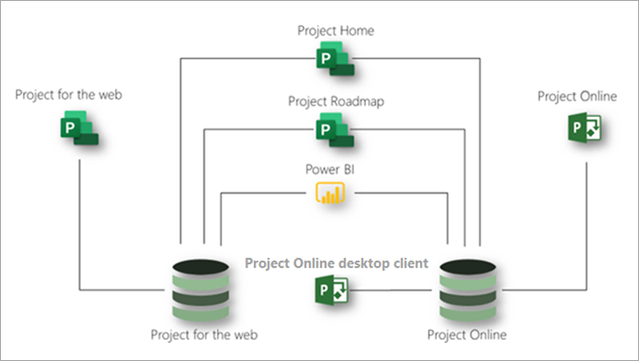

# Microsoft Project サービスの説明

## 概要

Microsoft Project は、組織のプロジェクトおよび作業管理のニーズを満たすために、次のアプリケーションを提供しています。

- Project for the web
- Project Online 
- Project Online デスクトップ クライアント

この記事は、各 Project のサブスクリプションで提供されるアプリケーションと、各アプリケーションが提供する機能を理解するのに役立ちます。

### Project for the web

Project for the web は、クラウドベースの作業とプロジェクト管理のための Microsoft の最新の製品です。 Project for the web は、ほとんどのニーズと役割を満たすためのシンプルで強力な作業管理機能を提供します。 プロジェクト マネージャーとチーム メンバーは、Project for the web を使用して、あらゆる規模の作業を計画および管理できます。

Project for the web は、Microsoft Power Platform 上に構築されています。 Power プラットフォームは、PowerApps、Power Automate、Power BI Microsoft Dataverse で構成されます。 Projectのデータは、Microsoft Dataverse に格納されます。 

Project for the web は、Project Plan 1、Project Plan 3、および Project Plan 5 の 3 つのサブスクリプションを通じて利用できます。 Web 機能のProject[機能は](#project-for-the-web-features)、Web データ ストアのデータProject操作します。

### Project Online
 
Project Online は、プロジェクト ポートフォリオ管理 (PPM) や毎日の業務で使用できる柔軟なオンライン ソリューションです。 Project Online は、ほぼすべてのデバイスのほぼどこからでも、優先順位付けの計画およびプロジェクトやプロジェクト ポートフォリオ投資&mdash;の管理を行う強力なプロジェクト管理機能を提供します。 管理者、ポートフォリオ管理者、ポートフォリオ ビューアー、プロジェクト管理者、リソース管理者、チーム リーダー、およびチーム メンバーが Project Online を使用できます。

Project Online は SharePoint プラットフォーム上に構築されており、SharePoint データ ストアにデータを格納します。

Project Online は、Project Plan 3 と Project Plan 5 の 2 つのサブスクリプションを通じて利用できます。 この機能にProject Online[機能は、](#project-online-features)データ ストア内のデータProject Online SharePoint操作します。

チーム メンバーの機能は、Project Onlineサブスクリプションを使用してProject Online EssentialsまたはProject Plan 1できます。 Project Online Essentialsは、チーム *メンバー* のアドオン サブスクリプションで、サブスクリプションをProject Plan 3またはProject Plan 5します。 Project Online EssentialsおよびProject Plan 1サブスクリプションを使用すると、チーム メンバーは Web インターフェイスを使用して、プロジェクトで管理されているプロジェクトに対してタスクと時間の更新をProject Online。

サブスクリプションを使用Project Online EssentialsまたはProject Plan 1メンバーは、次の機能をProject Onlineできます。

- Web ベースのインターフェースを使用する
- タスク、懸案事項、およびリスクの更新
- タイムシートの送信
- ドキュメントを共有し、Microsoft Teams または Skype for Business ユーザーと共同作業する

Project Online Essentials には、Project for the web は含まれていません。 Project Plan 1には、web とProjectの両方のProject Online Essentials。

### Project Online デスクトップ クライアント

Microsoft Project Online デスクトップ クライアントは、自動スケジュール設定、プロジェクト リソース管理、および組み込みのレポート機能を備えたプロジェクト管理プログラムです。 Project Online デスクトップ クライアントは、スタンドアロン アプリケーションとして使用することも、Project Online に接続することもできます。 Project Online デスクトップ クライアントは、Project Professional デスクトップ クライアントのサブスクリプション バージョンであり、Project Plan 3 および Project Plan 5 のサブスクリプションで利用できます。

### Project for the web と Project Online を一緒に使用する

Web ProjectアプリケーションとProject Onlineは別のアプリケーションですが、それらを並べて使用できます。 Project ホームでは、両方のアプリケーションのすべてのプロジェクトを表示できます。 Project ロードマップ機能を使用して、両方のアプリケーションのプロジェクトを含むロードマップを作成できます。 また、Power BI と Project for the Web Power BI のコンテンツ パックを使用して、2 つのアプリケーションにわたるプロジェクトとリソースに関する分析情報を得ることができます。3

次の図は、アプリケーションが並べて動作する方法を示しています。

Microsoft は今後、Project for the web の改革に重点を置きます。 ただし、Project Online は引き続きパフォーマンスとセキュリティが向上するため、安心してご利用いただけます。

## Microsoft Project のサブスクリプション

Microsoft Project は、組織のニーズに最適な 3 つの異なるサブスクリプションを通じて利用できます。 これらのサブスクリプションは、Project Plan 1、Project Plan 3、および Project Plan 5 です。 各サブスクリプションの機能を比較するには、「[各アプリケーションとサブスクリプションで利用可能な機能](#feature-availability-across-applications-and-subscriptions)」を参照してください。  

|製品 | Plan 1 | Plan 3 | Plan 5 |
|--------|-----------------------------|------------------------|------------------------|
|Project for the web |**x**  | **x x** | **x x** |
|Project Online |**x** |**x x**| **x x x** |
|Project Online デスクトップ クライアント | |**x**|**x**|

上の表のチェック数 (**x**) は、Plan によって提供される機能の一般的なレベルを示しています。 たとえば、プラン 5 Project Onlineプラン 3 より多くの機能を提供します。

## 各アプリケーションとサブスクリプションで利用可能な機能

### Project for the web の機能

このセクションにリストされている機能は、Project for the web のデータ ストアのデータとのみ相互作用します。 これらの機能はすべて、Microsoft Project のすべてのサブスクリプション (Project Plan 1、Project Plan 3、および Project Plan 5) で利用できます。  

| 機能 | 説明 | Office 365 のライセンス | Plan 1 | Plan 3 | Plan 5 |
|--------|-----------------------------|--------------|------------|------------|------------|
|**プロジェクト、タスク、および時間管理**||||||
|ボード ビュー | すぐに使用できるカスタム タスク ボードを使用して、ワークフローと状態の監視を改善するためにプロジェクト タスクを視覚的に追跡します。| 表示のみ | はい | はい| はい|
|依存関係 | タスク間の依存関係を設定して視覚的に追跡します。| 表示のみ | はい | はい| はい|
|グリッド ビュー | タスクの階層グリッド ビューを使用して、プロジェクトを計画および管理します。 | 表示のみ | はい | はい | はい |
|マイルストーン | 重要なプロジェクトとタスクのマイルストーンを確立して追跡します。|表示のみ | はい | はい | はい |
|Project ホーム | 開始日と終了日、および自動スケジュール設定を使用して、成果物を追跡および管理します。| はい | はい | はい | はい |
|タスクのスケジュール設定 | 最近取り組んだプロジェクトや、注意深く監視する必要のある重要なプロジェクトの全体像を把握できます。| 表示のみ | はい | はい | はい |
|タイムライン ビュー (ガント チャート)  | 階層タイムライン ビューでプロジェクトの日付、依存関係、割り当てを視覚的に追跡して理解します。|表示のみ | はい | はい | はい |
|サマリー タスク | サマリー タスクを使用して、成果物とフェーズを計画、管理、追跡します。| 表示のみ | はい | はい | はい |
|タスク ユーザー設定フィールドの作成と使用 | プロジェクトのタスクにローカル ユーザー設定フィールドを追加したり、これらのフィールドにデータを追加したり、これらのフィールドのデータを更新したりします。| 表示のみ | はい | はい | はい |
|**共同作業** ||||||
|Microsoft Teams の統合 | Microsoft Teams のプロジェクトで共同作業を行います。1 | はい | はい | はい | はい |
|**リソースとプログラムの管理** ||||||
|プロジェクト チームのセットアップ | メンバーの追加と削除、および作業予定表の設定により、プロジェクト チームを管理します。 | いいえ | はい | はい | はい |
|ロードマップ | プロジェクト全体の視覚的で対話型のロードマップをMicrosoft Project Online、Microsoft Project、およびプロジェクトAzure Boardsします。2このProject Plan 1ロードマップへの読み取り専用アクセス権を取得します。 ユーザー Project Plan 3またはProject Plan 5、ロードマップを作成できます。 | 表示のみ | 表示のみ | はい | はい |
|**レポート**3 ||||||
|Web データのProject *レポートを読み取* る | プロジェクト、プログラム、ポートフォリオ、およびリソース データを理解するために、アウトオブザボックスまたはカスタム レポート、ダッシュボードを表示します。 | はい | はい | はい | はい |
|Web データのProject *を使用してレポートを作成* する | すぐに使用できるレポートに基づいて、またはゼロからカスタム レポートを作成して、組織にとって重要なデータを理解します。  特定の組織のニーズを満たすのに役立つカスタム ダッシュボードを作成します。 | いいえ | はい | はい | はい |
|**使いやすさ** ||||||
|共同編集 | タスク リストやプロジェクト スケジュールなどを同時に作成、編集、更新するために、関係者やチーム メンバーと協力して作業します。| 表示のみ | はい | はい | はい |
|グラフィカル インジケーター | グラフィカル インジケーターでタスクの状態、割り当てなどを理解します。| 表示のみ | はい | はい | はい |
|**カスタマイズと統合**||||||
|アウトオブザボックス アプリケーションを使用Projectする | プロジェクトの表示、新しいプロジェクトProject、プロジェクトへの新しいデータの追加、または既存のプロジェクト データの更新を行う場合は、既存のアプリケーションを使用します。 | 表示のみ | はい | はい | はい |
|ビューとフォームのカスタマイズ 4 | アプリケーションで使用できるビューとフォームのみをカスタマイズProjectします。 | 表示のみ | はい | はい | はい |
|カスタム列の使用 | テーブルに追加された列のデータを表示、追加、更新、または削除します。 | 表示のみ | はい | はい | はい |
|カスタム テーブルの 使用 5 | プロジェクト、ポートフォリオなどに必要な追加データを保持するカスタム テーブルを作成および定義します。 | 表示のみ | はい | はい | はい |
|**Power Automateワークフローとビジネス プロセス フロー** 7 ||||||
| | カスタム テーブルや列Power Automate含むデータをProjectクラウド フローを定義して使用します。 | いいえ | はい | はい | はい |
| | カスタム Power Automate列を含むデータをProjectビジネス プロセス フローを定義します。 | いいえ | いいえ | はい | はい |
| | データPower Automate使用するビジネス プロセス フロー Project使用します。 | いいえ | はい | はい | はい |
|**セキュリティとユーザー管理**||||||
|Office モダン グループ | チーム メンバーが共有するリソースのコレクションを共同で簡単にセットアップできるプロジェクト チームを構築します。 | はい | はい | はい | はい |
|**サード パーティ製アプリ**||||||
|Connectアプリ *Projectを使用して Web* にアクセスする方法 4 | カスタム またはサード パーティ製のアプリケーションを使用して、ネイティブ テーブル内のデータを表示Project、更新、またはProjectします。 | 表示のみ11 | はい | はい | はい |

### Project Online の機能

このセクションにリストされている機能は、Project Online SharePoint のデータ ストアのデータとのみ相互作用します。 サブスクリプションを使用Project Online EssentialsまたはProject Plan 1メンバーは、一部の機能Project Onlineできます。 詳細については、「サービスの説明[- Microsoft Projectの説明」を参照|Microsoft Docs](/office365/servicedescriptions/project-online-service-description/project-online-service-description#project-online).  

|機能 | 説明 | Project Plan 3 | Project Plan 5 |
|--------|-------------|-----------------------------|------------------------|
|**プロジェクト、タスク、および時間管理**||||
|通知と事前通知 | Outlook および Microsoft Teams のリマインダーを使用して、今後の重要なタスクやプロジェクト イベントにスケジュールを合わせます。1| はい | はい |
|基準計画 | Project Web App を使用して、プロジェクトのベースラインを設定し、過去のパフォーマンスに対して現在のパフォーマンスを監視します。| はい | はい |
|ボード ビュー | ワークフローと状態の監視を改善するためにプロジェクト タスクを視覚的に追跡します。 | はい | はい |
|クリティカル パス | Project Web App を使用して、プロジェクトの最長パスを表すタスクを視覚的に追跡します。| はい | はい |
|成果物の管理 | 開始日と終了日、および自動スケジュール設定を使用して、成果物を追跡および管理します。| はい | はい |
|依存関係 | タスク間の依存関係を設定して視覚的に追跡します。| はい | はい |
|ガント ビュー | Project Web App を使用して、階層ガント チャート上のプロジェクトの日付、依存関係、および割り当てを視覚的に追跡して理解します。| はい | はい |
|グリッド ビュー | Project Web App を使用して、タスクの階層グリッド ビューを使用してプロジェクトを計画および管理します。| はい | はい |
|懸念事項とリスクの管理 | プロジェクトおよびタスク レベルで問題とリスクを識別して追跡します。| はい | はい |
|マスター プロジェクト | Project Web App を使用して、小さな関連プロジェクトを単一のマスター プロジェクトにグループ化します。 | はい | はい |
|通知 | Outlook と Teams の通知により、タスクの割り当て、状態、重要なプロジェクト イベントを常に把握できます。1 | はい | はい |
|Project ホーム | 最近取り組んだプロジェクトや、注意深く監視する必要のある重要なプロジェクトの全体像を把握できます。| はい | はい |
|プロジェクトのバージョン管理 | プロジェクトの異なるバージョンを、バージョン間の変更点を示すレポートで比較します。 | はい | はい |
|サマリー タスク | Project Web App のサマリー タスクを使用して、成果物とフェーズを計画、管理、追跡します。 | はい | はい |
|タスクのスケジュール設定 | Project Web App でタスクの開始日と終了日、労力、作業、リード タイムとラグ タイム、および依存関係を使用して、プロジェクトの日付の正確なスケジュールを取得します。 | はい | はい |
|タスクの更新 | プロジェクト タスク、非プロジェクト作業、および非稼働時間に関するコメントで時間と状態をキャプチャします。 | はい | はい |
|タイムライン | Project Web App を使用して、タイムライン ビューでプロジェクトの日付、依存関係、割り当てを視覚的に追跡して理解します。 | はい | はい |
|タイムシート | チーム メンバーは、タスク、非プロジェクト作業、および非稼働時間に対する時間と状態を入力できます。 | はい | はい |
|タイムシートの承認 | チーム メンバーはタイムシートを送信して承認を受けることができます。 リソース マネージャーとスーパーバイザーは、提出されたタイムシートを確認、承認、および拒否できます。 | はい | はい |
|非稼働時間のセットアップ | 休日、祝日、医療休暇、その他の非稼働時間を自分のプロジェクト スケジュールに追加します。 | いいえ | はい |
|**共同作業** ||||
|添付ファイル | ドキュメント、画像、その他のファイルをチーム、プロジェクト、またはタスク レベルで添付します。 チームまたはプロジェクト レベルで中央のライブラリでこれらの添付ファイルを管理します。 | はい | はい |
|外部チーム メンバー |プロジェクト、タスク、ドキュメントを表示および操作するためのアクセス権を付与し、組織外のユーザーと共同作業します。6 | はい | はい |
|プロジェクト サイト | プロジェクトの共同作業とドキュメントのハブを作成およびカスタマイズします。 | はい | はい |
|Microsoft Teams の統合 | Microsoft Teams のプロジェクトで共同作業を行います。1 | はい | はい |
|**需要管理** ||||
|プロジェクト要求の承認ワークフローの設定 | 次期の需要の評価、優先順位付け、および承認に必要なワークフローを構築します。 | いいえ | はい |
|プロジェクト依頼書の作成 | 新しい作業の評価と優先順位付けに役立つ、次期の需要に関する重要なデータを収集します。 | 不要 | はい |
|プロジェクトの要求 | 組織内および外部の顧客やパートナーからの次期の需要を追跡、管理、評価、および優先順位付けします。 | はい | はい |
|**リソース、プログラム、ポートフォリオの管理** ||||
|プロジェクトのコストと予算 | Project Web App を使用して、計画された進捗状況と予算を実際の時間とコストと比較します。 | はい | はい |
|プロジェクト チームのセットアップ | メンバーの追加と削除、割り当てレベルの設定、外部メンバーの追加により、プロジェクト チームを管理します。 | はい | はい |
|リソース容量ビュー | プロジェクト、チーム、および組織レベルでリソース容量を追跡および管理します。 | はい | はい |
|リソースのコスト | プロジェクトのリソースのコストを追跡および管理します。 | はい | はい |
|リソース管理 (予約) | プロジェクト マネージャーは、役割、スキル、または名前でリソースの要求を送信できます。 リソース マネージャーは要求を確認し、利用可能な最良のリソースを割り当てることができます。 |はい8 | はい9 |
|リソースの容量の計画 | プロジェクト、チーム、および組織レベルでリソース容量を追跡および管理します。 | いいえ | はい |
|ロードマップ | Microsoft Project Online、Microsoft Project for the web、Azure Boards プロジェクトのプロジェクト間で、視覚的でインタラクティブなロードマップを作成します。2 | はい | はい |
|ポートフォリオ分析と優先度設定 | 組織の事業戦略に最適なプロジェクト ポートフォリオを特定、選択、および遂行し、投資回収率 (ROI) を最大化します。 | いいえ | はい |
|ダッシュボード/ポータル | リアルタイムのインタラクティブ ダッシュボードを使用して、ポートフォリオ、プログラム、プロジェクト、タスク、チーム、リソース レベルで状態、優先順位付けなどを理解します。 | はい | はい |
|時間単価型リソース、標準リソース、数量単価型リソース | 人などの時間単価型リソース、建築職人などの特定のスキルを持つ標準リソース、コンピューターやセメントなどの数量単価型リソースなどの各リソースをプロジェクトに追加します。 | はい | はい |
|**レポート**3 ||||
|すぐに使えるレポート | 事前に作成されたレポートを使用して、プロジェクト、プログラム、ポートフォリオ、およびリソース データを理解します。 | はい | はい |
|カスタム レポート | すぐに使用できるレポートに基づいて、またはゼロからカスタム レポートを作成して、組織にとって重要なデータを理解します。 | はい | はい |
|ダッシュボードとポータル | 特定の組織のニーズを満たすのに役立つカスタム ダッシュボードとポータルを構築します。 | はい | はい |
|**カスタマイズと統合**||||
|カスタム ブランディング | 独自のブランド、ロゴ、色を使用してプロジェクトの展開をカスタマイズします。 | いいえ | はい |
|カスタム フィールド | プロジェクト、タスク、リソース レベルでカスタム フィールドを追加して、組織やプロジェクトにとって重要なデータを追跡します。 | はい | はい |
|数式 | タスクやプロジェクト全体の数式を使用して、重要なデータを計算およびキャプチャします。 | はい | はい |
|PowerApps | PowerApps を使用して (OData を介して) Web およびモバイル向けのソリューションを構築および利用します。4 | はい | はい |
|ワークフロー | (OData を通じて) ビジネス プロセスを自動化し、Power Automate。7 | はい | はい |
|Microsoft 365 の統合 | 使い慣れた Microsoft のツールとアプリケーションを使用して、ドキュメントの共同作業や管理などを行います。1 | はい | はい |
|Microsoft Planner の統合 | プロジェクト タスクを Planner の計画に関連付け、Planner で詳細な作業を追跡します。1 | はい | はい |
|**セキュリティ、ユーザー、サービス管理**||||
|Active Directory の統合 | 組織の Active Directory の任意のメンバーからチームを作成します。10 | はい | はい |
|ユーザーの管理 | プロジェクト、チーム、組織レベルでユーザーとグループの役割と権限を管理します。 | 不要 | はい |
|サービス管理 | Microsoft Project 環境を Office 3651 環境の一部として計画、インストール、構成、維持、および拡張します。 | いいえ | はい |

#### Notes

1 Office または Microsoft 365 の商用サブスクリプションが必要です。 
2 Azure Boards は別途取得されます。 
3 Web および web Projectのレポートは、Project OnlineライセンスPower BI必要Power BIします。 
4 web または Project Online 顧客データに対して Project にアクセスする、Project アプリケーション以外の個別の Power Apps を構築して使用するには、別の Power Apps サブスクリプションが必要です。 
5 5 つのカスタム テーブルに制限されています。 
6 Project Online の外部ユーザー用のライセンスは、内部ユーザー用と同じポリシーに準じます。 Project Online サイトでのやり取りには、Project Plan 3 または Project Plan 5 のサブスクリプションが必要です。 
7 Power Automate内Projectは、アプリケーションのコンテキストにProjectされます。 つまり、トリガーとアクションの両方に対して、トリガーに含まれるフロー Projectできます。

- Connectアプリケーションの使用権限内の任意のデータ ソースにProjectします。
  - 標準コネクタ経由で使用可能なデータ ソース
  - Project Microsoft Dataverse コネクタを介してデータを収集する
- (組み込みのトリガー/アクションProject) アプリケーション内から直接トリガーされる

フローが分離され、Projectアプリケーションとは関係ない場合は、プラットフォーム ライセンスを購入する必要があります。 
8サブスクリプションのProject Plan 3またはProject Plan 5ユーザーは、リソースエンゲージメント要求を送信できます。 リソース管理の要求を確認、実行、または承認することはできません。 
9サブスクリプションを使用しているユーザー Project Plan 5、リソースエンゲージメント要求を確認、履行、および承認できます。 
10 Active Directory には、個別のサブスクリプションが必要です。  
11 View only entitlements は Power App 内からのみ付与されます。  

### Project Online デスクトップ クライアントの機能

| 機能 | 説明 |
|--------|-------------|
|**プロジェクトとタスクの管理**||
|基準計画 | プロジェクトのベースラインを設定し、過去のパフォーマンスに対して現在のパフォーマンスを監視します。 |
|予定表ビュー | 週次または月次の予定表ビューで、重要なプロジェクトとタスクの期限とマイルストーンを追跡します。 |
|クリティカル パス | プロジェクトの最長パスを表すタスクを視覚的に追跡します。 |
|期限 | 重要なプロジェクトとタスクの期限を確立して追跡します。 |
|依存関係 | タスク間の依存関係を設定して視覚的に追跡します。 |
|ガント ビュー | 階層ガント ビューでプロジェクトの日付、依存関係、割り当てを視覚的に追跡して理解します。 |
|グリッド ビュー | タスクの階層グリッド ビューを使用して、プロジェクトを計画および管理します。 |
|マスター プロジェクト | 小さな関連プロジェクトを単一のマスター プロジェクトにグループ化します。 |
|マイルストーン | 重要なプロジェクトとタスクのマイルストーンを確立して追跡します。 |
|ネットワーク ダイアグラム | プロジェクトのタスク、依存関係、およびクリティカル パスをネットワーク ダイアグラムのビューに表示します。 |
|タスクのスケジュール設定 | タスクの開始日と終了日、労力、作業、リード タイムとラグ タイム、および依存関係を使用して、プロジェクトの日付の正確なスケジュールを取得します。 |
|チーム プランナー | 非プロジェクト作業時間と非作業時間を含む、すべてのプロジェクト チーム メンバーの割り当てと容量を追跡します。|
|タイムライン | タイムライン ビューでプロジェクトの日付、依存関係、割り当てを視覚的に追跡して理解します。 |
|非アクティブなタスク | 非アクティブなタスクを使用して、リソースの可用性や割り当てに影響を与えたり、プロジェクト スケジュールに影響を与えたりすることなく、作業を追跡します。 |
|サマリー タスク | サマリー タスクを使用して、成果物とフェーズを計画、管理、追跡します。 |
|タスクの詳細情報 | 変更された開始日やエラー メッセージなどのタスクのスケジューリングに影響する要因を表示します。 |
|タスク パス解析 | プロジェクト全体のタスクのタスク パスを強調表示して、タスクの他のタスクとの関係を参照します。 |
|**リソースと財務管理**||
|リソースの平準化 | 割り当てを自動的に平準化することにより、リソースの競合または割り当て超過を解決します。 |
|時間単価型リソース、標準リソース、数量単価型リソース | 人などの時間単価型リソース、建築職人などの特定のスキルを持つ標準リソース、コンピューターやセメントなどの数量単価型リソースなどの各リソースをプロジェクトに追加します。 |
|プロジェクトのコストと予算 | 計画された進捗状況と予算を実際の時間とコストと比較します。 |
|リソースのコスト | プロジェクトのリソースのコストを追跡および管理します。|
|**レポート** ||
|カスタム レポート | プロジェクト、プログラム、ポートフォリオ、リソースのカスタム レポートを作成します。 |
|すぐに使えるレポート | 事前に作成されたレポートを使用して、プロジェクト、プログラム、ポートフォリオ、およびリソース データを理解します。 |
|PDF および XPS 出力 | プロジェクト ファイルを PDF または XPS ファイルとして保存します。 |
|**使いやすさ**||
|オートコンプリート | 入力に応じてタスクまたはリソース名の候補と依存関係を表示します。 |
|フィルター処理されたビュー | 計画に含まれる値を使用して、Project Plan をフィルター処理する |
|グラフィカル インジケーター | グラフィカル インジケーターでタスクの状態、割り当てなどを理解します。 |
|マルチレベルで元に戻す | **[元に戻す]** メニューを使用して、同時に複数の変更を元に戻します。 |
|並べ替えとグループ化 | カスタムの並べ替えとグループ化を使用して、プロジェクト、タスク、リソースの焦点を絞ったビューを取得します。|
|**カスタマイズと統合**||
|カスタム フィールド | プロジェクト、タスク、リソース レベルでカスタム フィールドを追加して、組織やプロジェクトにとって重要なデータを追跡します。 |
|フォーム | カスタム フォームを作成して展開し、重要なプロジェクト データをキャプチャします。 |
|数式 | タスクやプロジェクト全体の数式を使用して、重要なデータを計算およびキャプチャします。 |
|テンプレート | Project Plan、チーム、割り当てなどの一般的なプロジェクトのテンプレートを作成します。 |
|.mpp インポート/エクスポート | 既存の .mpp ファイルから新しいプロジェクトを作成するか、既存のプロジェクトの .mpp ファイルを作成します。 |
|Excel のインポート/エクスポート | Excel ファイルから新しいプロジェクトを作成するか、既存のプロジェクトの .Excel ファイルを作成します。 |

## サービスに関する考慮事項

> [!NOTE]
> Project for the web は現在、GCC、GCC High、および DoD では利用できません。 現在、Project for the web の提供に取り組んでいますが、現時点では確定した期間を共有できません。

### ライセンスに関する考慮事項

- サイト上の操作Project Online、テナント内で少なくとも 1 Project Plan 3またはProject Plan 5サブスクリプションが必要です。
- 最後の Project Plan 1、Project Plan 3、または Project Plan 5 サブスクリプションの有効期限が切れると、Microsoft Dataverse に依存するアクティブなサブスクリプションがない場合、Web インスタンスの Project は自動的に削除されません。
- 最後の Project Plan 3、または Project Plan 5 のサブスクリプションが期限切れになると、Project Online のインスタンスは 120 日後に削除されます。
- 試用版Project Onlineの場合、試用版インスタンスは試用期間が終了した 30 日後に削除されます。
- Web Projectサブスクリプションの場合、Microsoft Dataverse に依存するアクティブなサブスクリプションがない場合、試用版インスタンスは削除されません。

### SharePoint Online の使用

Project Online では、Project Online の一部としてプロビジョニングされている SharePoint Online を使用する必要があります。 Project Plan 3 または Project Plan 5 サブスクリプションで提供される SharePoint Online 機能への権利は、Project Online をサポートするためのデータの保存とアクセスに限定されます。

### Project ロードマップと Power Automate

Project ロードマップでは、Power Automate の使用が必要です。これは、Project サブスクリプションの一部としてプロビジョニングされます。 Power Automate 機能の権利は、Project ロードマップで必要な Power Automate 機能に限定されます。 Project ロードマップに必要な Power Automate 機能は、Microsoft 365 管理センターの「**アプリ**」セクションの「**フローを使用し Project のデータ統合**」サービス プランとして表示されます。

### Projectおよび Microsoft Dataverse の詳細

Projectには、データを格納するために Microsoft Dataverse を使用する必要があります。 Microsoft Dataverse データベースは、サブスクリプションの一部としてProjectされます。 Microsoft Dataverse の機能に対する権利は、Web のデータの保存とアクセスをサポートするためにProject制限されます。 Microsoft Dataverse の機能は、Project の [アプリ] セクションの Project サービス プランの共通データ サービスとして表示Microsoft 365 管理センター。

Project Web ライセンス用に 5 つ以上の Project を持つお客様の場合、web ユーザーの Project は Power Platform Production 環境および Sandbox 環境に展開できます。

| 含まれる/見越された容量                                      | ProjectP1 | ProjectP3 | ProjectP5 |
|--------------------------------------------------------------------|------------|------------|------------|
| Dataverse (以前は一般的なデータ サービス) データベース: 組み込み/テナント | 3 GB        | 5 GB        | 5 GB        |
| Dataverse データベース: 見越/ユーザー サブスクリプション ライセンス (USL)        | 50 MB       | 250 MB      | 250 MB      |
| Dataverse ログ: 組み込み/テナント                                     | 2 GB        | 2 GB        | 2 GB        |
| Dataverse ファイル: 組み込み/テナント                                    | 20 GB       | 20 GB       | 20 GB       |
| Dataverse ファイル: 見越/USL                                        | 400 MB      | 2 GB        | 2 GB        |

### データのバックアップと保持

Project for the web と Project Online には、Office 365 と同じデータ バックアップと保持ポリシーがあります。 詳細については、「[Office 365 でのデータの保持、削除、および破棄](/office365/Enterprise/office-365-data-retention-deletion-and-destruction-overview)」を参照してください。

### データ暗号化

- データ暗号化の詳細については、「Project Onlineのデータ暗号化OneDrive for Businessオンライン Microsoft 365 - SharePoint コンプライアンス | [Microsoft Docs](/microsoft-365/compliance/data-encryption-in-odb-and-spo)
- web のデータ Project暗号化の詳細については[、「Microsoft Dynamics 365 の暗号化 - Microsoft 365 コンプライアンス |」を参照|Microsoft Docs](/microsoft-365/compliance/office-365-encryption-in-microsoft-dynamics-365)

### Project for the web の境界と制限

Project for the web には、次の表で説明するいくつかの制限があります。  

| エンティティ/フィールド | 制限 |
|-------------|-------|
|**タスク** ||
|最大 タスクの階層レベル | 10 レベル |
|最大 タスクのリンク (後続タスクと先行タスク) | 20 |
|最大 リーフ タスクの期間 | 1250 日間 |
|最大 サマリー タスクの期間 | 3650 日 (10 年) |
|最大 タスクに割り当てることができるリソース | 20 リソース |
|タスクのサポートされている日付範囲 | 1984/1/1 &ndash; 2149/12/31 |
|**プロジェクト** ||
|最大 プロジェクトの合計タスク | 500 |
|最大 プロジェクトの合計期間 | 3650 日 (10 年) |
|最大 プロジェクトの合計リソース | 150 |
|最大 プロジェクトの合計リンク (後継のみ) | 600 |

### Project Online の境界と制限

Project Online にはいくつかの制限があります。 詳細については、「[Project Online: ソフトウェアの境界と制限 ](https://support.office.com/article/5A09DBCE-1E68-4A7B-B099-D5F1B21BA489)」をご覧ください。
